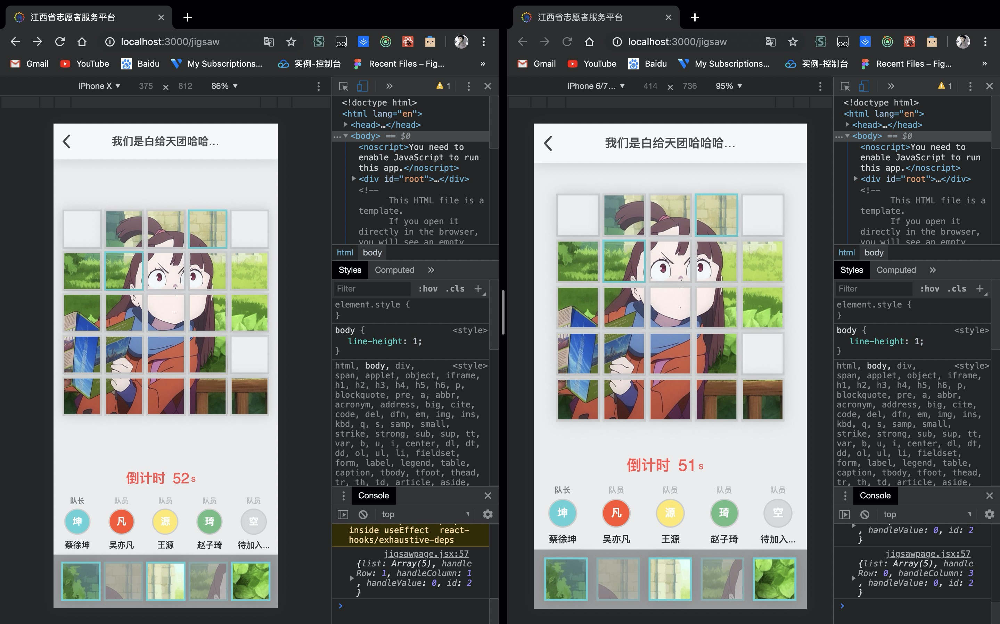

# 拼图游戏

## 项目地址

https://jigsaw.icecee.com

## 目前进度



`设计`

## 开发环境调试

虚假的后端服务
```
node server.js
```

前端服务
```
yarn start
```
进入`localhost:3000/jigsaw`进行调试

## 前端服务部署到OSS

目录下新建 `ossMsg.json` 文件

### Example 如下
 ```
{
    "Region": "",
    "Bucket": "",
    "AccessKeyId": "",
    "AccessKeySecret": ""
}
 ```
 
然后执行

```
yarn deploy
```

## 基本流程

### 登录

输入密码与学号（云家园）

### 首页

1. 创建房间 -> 输入队伍名(不重复) -> 选择人数（难度 -> 生成队伍序号 -> 准备游戏 -> 开始游戏(随机给图片)

2. 加入房间 -> 输入房间号 -> 人满 ? 提示房间已满 : (进入房间 -> 已经开始游戏 ? 直接加入游戏 : 准备游戏 )

3. 查看排行 ->（todo）

## 拼图逻辑

### 倒计时

当队伍足够该难度人数时 游戏倒计时开始

### 拼图设置

设定了三个难度 以便于能够让所有人都进行游戏

| 难度 | 人数 | 拼图 | 分数设置 | 玩家手持切片数
| --- | --- | ---| --- | --- |
| easy(3) | 3人 | 3x3 | (over/time)*3 | 3个
| normal(4) | 4人 | 4x4 | (over/time)*4 | 4个
| hard(5) | 5人 | 5x5 | (over/time)*5 | 5个

> over为评价完成度的数值


### 前后通信websocket部分

每次有人进入房间进行准备模式时，向该人发送

```json
{
  "roomName": "F4",         //队伍名
  "roomId": 114512,         //房间号
  "members": [              //该房间用户信息
      {
          "username": "蔡徐坤",     //用户名
          "identity": "leader",    //用户身份
          "id": 1                  //用来标示其在房间内的序号
      },
      {
          "username": "吴亦凡",
          "identity": "member",
          "id": 2
      },
      {
          "username": "王源",
          "dentity": "member",
          "id": 3
      },
      {
          "username": "赵子琦",
          "identity": "member",
          "id": 4
      }
  ]
}
```
向房间内其他人发送
```json
{
  "userame": "sxy",         //用户名
  "userId": 114512,         //用户学号
  "members": [              //该房间用户信息
      {
          "username": "蔡徐坤",     //用户名
          "identity": "leader",    //用户身份
          "id": 1                  //用来标示其在房间内的序号
      },
      {
          "username": "吴亦凡",
          "identity": "member",
          "id": 2
      },
      {
          "username": "王源",
          "dentity": "member",
          "id": 3
      },
      {
          "username": "赵子琦",
          "identity": "member",
          "id": 4
      }
  ]
}
```
leader开始游戏时
```json
{
    "members": [              //该房间用户信息
      {
          "username": "蔡徐坤",     //用户名
          "identity": "leader",    //用户身份
          "id": 1                  //用来标示其在房间内的序号
      },
      {
          "username": "吴亦凡",
          "identity": "member",
          "id": 2
      },
      {
          "username": "王源",
          "dentity": "member",
          "id": 3
      },
      {
          "username": "赵子琦",
          "identity": "member",
          "id": 4
      }
    "starTime": 
}
```
房间内所有成员接收
```json
{
  "username": "赵子琦",      //用户名
  "roomName": "F4",         //队伍名
  "roomId": 114512,         //房间号
  "picKind": 2,             //选图
  "difficult": 4,           //难度
  "jigsawList": [           //该房间此时的游戏进程
      [0, 2, 3, 0],
      [0, 6, 0, 8],
      [9, 10, 11, 12],
      [13, 14, 15, 16]
  ],
  "pics": [1, 4, 5, 7],     //该用户可操作的卡片
  "endTime": 1234123,
  "members": [              //该房间用户信息
      {
          "username": "蔡徐坤",     //用户名
          "identity": "leader",    //用户身份
          "id": 1                  //用来标示其在房间内的序号
      },
      {
          "username": "吴亦凡",
          "identity": "member",
          "id": 2
      },
      {
          "username": "王源",
          "dentity": "member",
          "id": 3
      },
      {
          "username": "赵子琦",
          "identity": "member",
          "id": 4
      }
  ]
}
```
每次有人加入游戏时，向该人发送（根据`token`返回）
```json
{
  "username": "赵子琦",      //用户名
  "roomName": "F4",         //队伍名
  "roomId": 114512,         //房间号
  "picKind": 2,             //选图
  "difficult": 4,           //难度
  "jigsawList": [           //该房间此时的游戏进程
      [0, 2, 3, 0],
      [0, 6, 0, 8],
      [9, 10, 11, 12],
      [13, 14, 15, 16]
  ],
  "pics": [1, 4, 5, 7],     //该用户可操作的卡片
  "endTime": 1234123,
  "members": [              //该房间用户信息
      {
          "username": "蔡徐坤",     //用户名
          "identity": "leader",    //用户身份
          "id": 1                  //用来标示其在房间内的序号
      },
      {
          "username": "吴亦凡",
          "identity": "member",
          "id": 2
      },
      {
          "username": "王源",
          "dentity": "member",
          "id": 3
      },
      {
          "username": "赵子琦",
          "identity": "member",
          "id": 4
      }
  ]
}
```
并向该房间其他人广播 (ws会根据关键字回调相应函数)(服务器监听并将此人从数组中加入)
```json
{
    "username": "赵子琦",
    "id": 4 
}
```
移动拼图后 向该房间非己成员广播 并将`list`序列化存储在在redis中
```json
{
    "list": [    
      [0, 2, 3, 4],
      [0, 6, 0, 8],
      [9, 10, 11, 12],
      [13, 14, 15, 16]
    ],
    "handleRow": 0,
    "handleColumn": 3,
    "user": "赵子琦"
    "members": [              //该房间用户信息
      {
          "username": "蔡徐坤",     //用户名
          "identity": "leader",    //用户身份
          "id": 1                  //用来标示其在房间内的序号
      },
      {
          "username": "吴亦凡",
          "identity": "member",
          "id": 2
      },
      {
          "username": "王源",
          "dentity": "member",
          "id": 3
      },
      {
          "username": "赵子琦",
          "identity": "member",
          "id": 4
      }
  ]
}
```

某人退出游戏 向该房间非某人成员广播 (ws会根据关键字回调相应函数)(服务器监听并将此人从数组中删除)
```json
{
    "username": "赵子琦",
    "id": 4 
}
```

### 结束游戏

#### 中途退出
向所有人发送此人退出信息, 游戏继续进行

#### 因5分钟倒计时已到而结束
强行上交矩阵/队伍与房间信息 并计算出分数（time=300）

#### 未到5分钟 因为拼完而结束
队长提交矩阵/完成时间/队伍与房间信息 并计算出分数 

### TODO 房间前后端通信

### TODO 排名与over数值具体算法